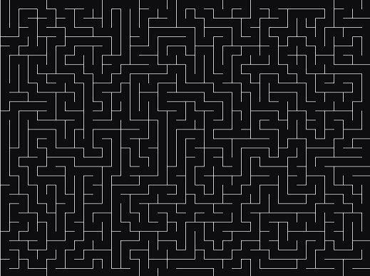

# MazeGenerator 

Maze generator for console and SDL written in C++ using [depth-first search](https://en.wikipedia.org/wiki/Maze_generation_algorithm)



## Quick start

### CONSOLE_ASCII_Windows:

### `Build:`
```console
> g++ main.cpp
```
### `Run:`
```console
> a.exe
```

### SDL2_Maze:

If you want to compile through console / terminal on Windows:

```console
> build
> main
```

If you're using Visual Studio:

### `Build and Run`:
- In Project->Properties->Configuration Properties->VC++ Directories | Add to: Include Directories -> `dependencies/include`, Library Directories -> `dependencies/lib`
- In Project->Properties->Linker->Input->Additional Dependencies | Add: `SDL2.lib` and `SDL2main.lib`
- After you build your solution / project, add `SDL2.dll` to the folder containing your `.exe` file
